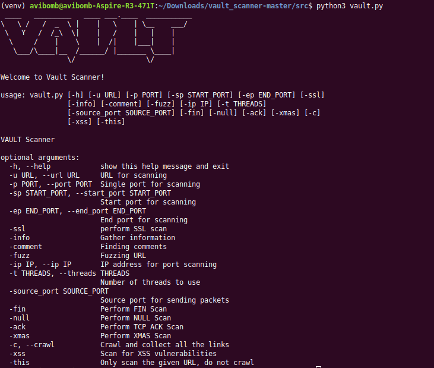

# VAULT Scanner

[](https://app.codacy.com/app/abhisharma404/vault_scanner?utm_source=github.com&utm_medium=referral&utm_content=abhisharma404/vault_scanner&utm_campaign=Badge_Grade_Dashboard)
[](https://github.com/abhisharma404/vault_scanner) 
[](https://gitter.im/vault_scanner/Lobby?utm_source=badge&utm_medium=badge&utm_campaign=pr-badge&utm_content=badge) 


Vault Scanner can be used for:

* Scan a website for the following:
      - [XSS](https://www.owasp.org/index.php/Cross-site_Scripting_(XSS))
      - [LFI](https://en.wikipedia.org/wiki/File_inclusion_vulnerability#Local_File_Inclusion)
      - [RFI](https://en.wikipedia.org/wiki/File_inclusion_vulnerability#Remote_File_Inclusion)
      - [SQLi](https://en.wikipedia.org/wiki/SQL_injection)

* Common header erros:
      - Clickjacking
      - jQuery
      - Insecure cookie flags
      - Session fixation through a cookie injection
      - Spoofing Agents
      - Brute force login through authorization header
      - Testing HTTP methods
      - Insecure headers

* Collecting data:
      - Port scanning
      - IP Scanning
      - Header grabbing
      - Banner grabbing
      - Finding comments in source code
      - Smartwhois scan
      - Check if error handling is done or not and extract the site data using that information.
      - OS scanning.

* SSL scanner.

* Crawl a website and collect all the URLs.

* Scrape a website and collect all the images.

* [URL fuzzing](https://en.wikipedia.org/wiki/Fuzzing).

* [Shellshock](https://en.wikipedia.org/wiki/Shellshock_(software_bug)) checking.

# Getting Started

Steps to setup :

1. `git clone <your-fork-url>`
2. `cd vault_scanner`
3. `sudo apt-get install python3-pip`
4. `sudo pip3 install virtualenv`
5. `virtualenv venv`
6. `source venv/bin/activate`
7. `pip3 install -r requirements.txt`

Starting Vault :

1. `cd vault_scanner/src`
2. `python3 vault.py`

# Usage

```
usage: vault.py [-h] [-u URL] [-p PORT] [-sp START_PORT] [-ep END_PORT] [-ssl]
                [-info] [-comment] [-fuzz] [-ip IP] [-t THREADS]
                [-source_port SOURCE_PORT] [-fin] [-null] [-ack] [-xmas] [-c]
                [-xss] [-this]

optional arguments:
  -h, --help            show this help message and exit
  -u URL, --url URL     URL for scanning
  -p PORT, --port PORT  Single port for scanning
  -sp START_PORT, --start_port START_PORT
                        Start port for scanning
  -ep END_PORT, --end_port END_PORT
                        End port for scanning
  -ssl                  perform SSL scan
  -info                 Gather information
  -comment              Finding comments
  -fuzz                 Fuzzing URL
  -ip IP, --ip IP       IP address for port scanning
  -t THREADS, --threads THREADS
                        Number of threads to use
  -source_port SOURCE_PORT
                        Source port for sending packets
  -fin                  Perform FIN Scan
  -null                 Perform NULL Scan
  -ack                  Perform TCP ACK Scan
  -xmas                 Perform XMAS Scan
  -c, --crawl           Crawl and collect all the links
  -xss                  Scan for XSS vulnerabilities
  -this                 Only scan the given URL, do not crawl
  -ping_sweep           ICMP ECHO request
  -ip_start_range IP_START_RANGE
                        Start range for scanning IP
  -ip_end_range IP_END_RANGE
                        End range for scanning IP
```

Example Usage :

`python3 vault.py -u 'http://url' -info -comment -ssl -fuzz`

# Screenshot


